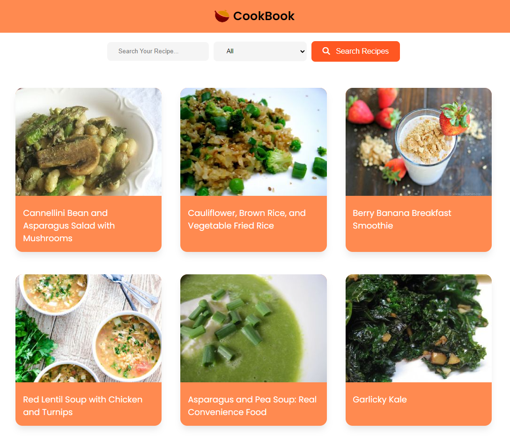

# PROJECT NAME

JOBarcelona '23 | Frontend - CookBook Web

> Creación de una web de recetas que consume datos de la API spoonacular. Consta de un buscador de recetas con un filtro por tipo de dieta. Al seleccionar una receta se muestra la información especifica de esa receta.

## API/Component

El nombre, la descripción y el uso de este módulo me parecen atractivos. Es muy probable que utilice este módulo en este momento. Solo necesito escanear la API para asegurarme de que haga exactamente lo que necesito y que se integre fácilmente en mi base de código.

La sección de API debe detallar los objetos y funciones del módulo, sus firmas, tipos de devolución, devoluciones de llamada y eventos en detalle. Los tipos deben incluirse donde no sean obvios. Deben dejarse claras las advertencias.

## Installation

Dentro de un ecosistema en particular, puede haber una forma común de instalar cosas, como usar Yarn, NuGet o Homebrew. Sin embargo, considere la posibilidad de que quien esté leyendo su archivo README sea un novato y desee más orientación. Enumerar los pasos específicos ayuda a eliminar la ambigüedad y hace que las personas usen su proyecto lo más rápido posible. Si solo se ejecuta en un contexto específico, como una versión de lenguaje de programación o un sistema operativo en particular, o tiene dependencias que deben instalarse manualmente, agregue también una subsección de Requisitos.

```shell
    # Clone or install commands
    npm i
```

```shell
    # test o run commands
    npm run dev ...
```

## Stack | Not using the common-readme | Not required

- HTML
- CSS
- JavaScript
- Vue.js 3

## Roadmap and visuals | Not using the common-readme | Not required



## Contribución y Apoyo | Not using the common-readme | Not required

Puedes comentar el proceso de que tiene que hacer una persona si quiere colaborar o apoyar el proyecto.

## Contact info | Not using the common-readme | Not required | Recommended

Pon tu información básica de contacto

## Reconocimientos | Not using the common-readme | Not required

Aquí puedes poner información extra sobre las librerias, documentación o proyectos que has utilizado para crear tu proyecto y perason u organizaciones que lo han apoyado

<a href="https://www.freepik.es/vector-gratis/compra-bolsas-papel-o-plastico-canasta-productos-como-leche-pan-desayunos-conjunto-ilustracion-dibujos-animados_20827894.htm#query=cesta%20ingredientes&position=9&from_view=search&track=ais">Imagen de pch.vector</a> en Freepik

## License

Inlcuir la licéncia y el link a esta
[MIT](https://opensource.org/licenses/MIT)
