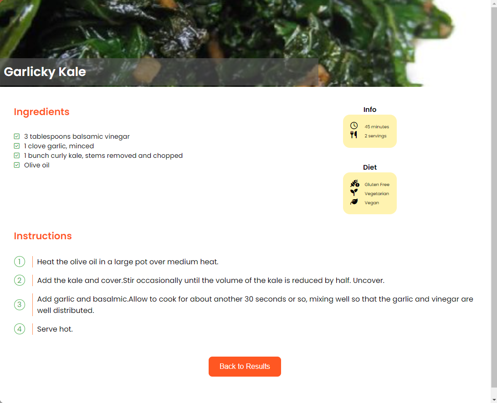

# CookBook

JOBarcelona '23 | Frontend - CookBook Web

> Creación de una web de recetas que consume datos de la API spoonacular. Consta de un buscador de recetas con un filtro por tipo de dieta. Al seleccionar una receta se muestra la información especifica de esa receta.

## API/Component

El nombre, la descripción y el uso de este módulo me parecen atractivos. Es muy probable que utilice este módulo en este momento. Solo necesito escanear la API para asegurarme de que haga exactamente lo que necesito y que se integre fácilmente en mi base de código.

La sección de API debe detallar los objetos y funciones del módulo, sus firmas, tipos de devolución, devoluciones de llamada y eventos en detalle. Los tipos deben incluirse donde no sean obvios. Deben dejarse claras las advertencias.

## Installation

```shell
    # Clone or install commands
    npm i
```

```shell
    # test o run commands
    npm run dev ...
```

## Stack | Not using the common-readme | Not required

- HTML
- CSS
- JavaScript
- Vue.js 3

## Roadmap and visuals | Not using the common-readme | Not required




## Contact info | Not using the common-readme | Not required | Recommended

Angela Garcia Muñoz - [LinkedIn](https://www.linkedin.com/in/angela-garcia-mu/)

Correo electrónico: [angelagm0112@gmail.com](mailto:angelagm0112@gmail.com)

Web del proyecto: [Vercel](https://jo-barcelona23-nuwe.vercel.app/)

## Reconocimientos | Not using the common-readme | Not required

<a href="https://www.freepik.es/vector-gratis/compra-bolsas-papel-o-plastico-canasta-productos-como-leche-pan-desayunos-conjunto-ilustracion-dibujos-animados_20827894.htm#query=cesta%20ingredientes&position=9&from_view=search&track=ais">Imagen de pch.vector</a> en Freepik

## License

Inlcuir la licéncia y el link a esta
[MIT](https://opensource.org/licenses/MIT)

[](https://www.codefactor.io/repository/github/angela-gm/jobarcelona23-nuwe)
